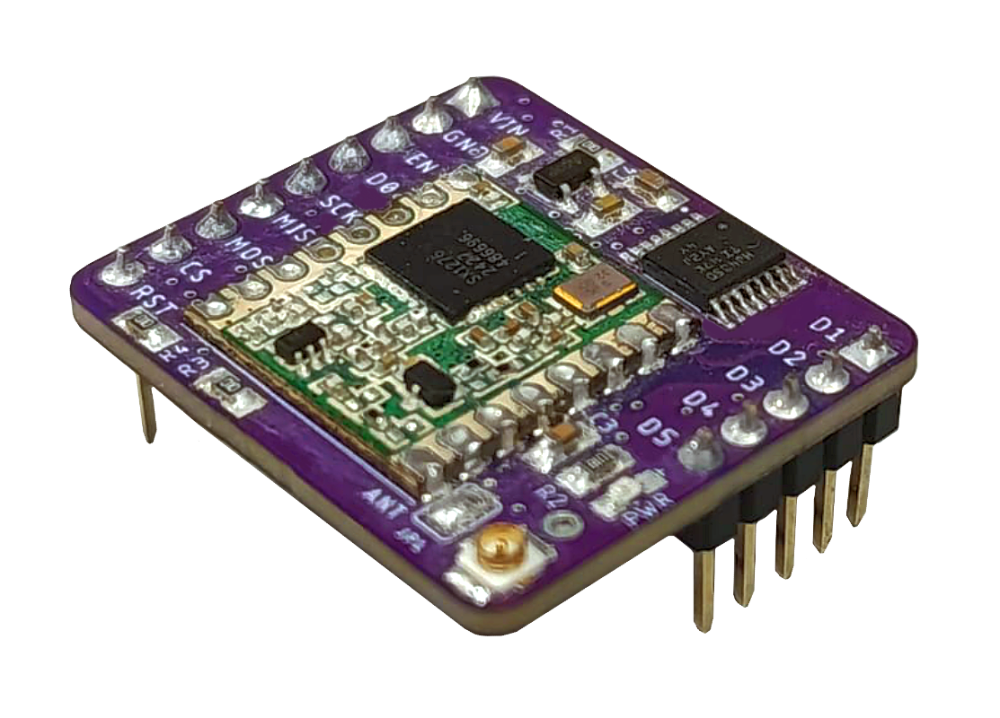
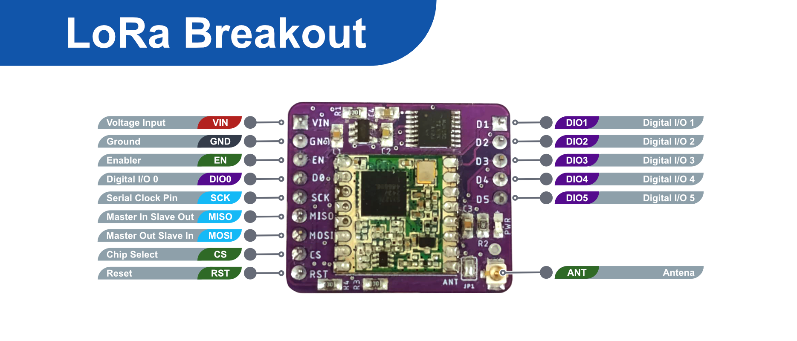
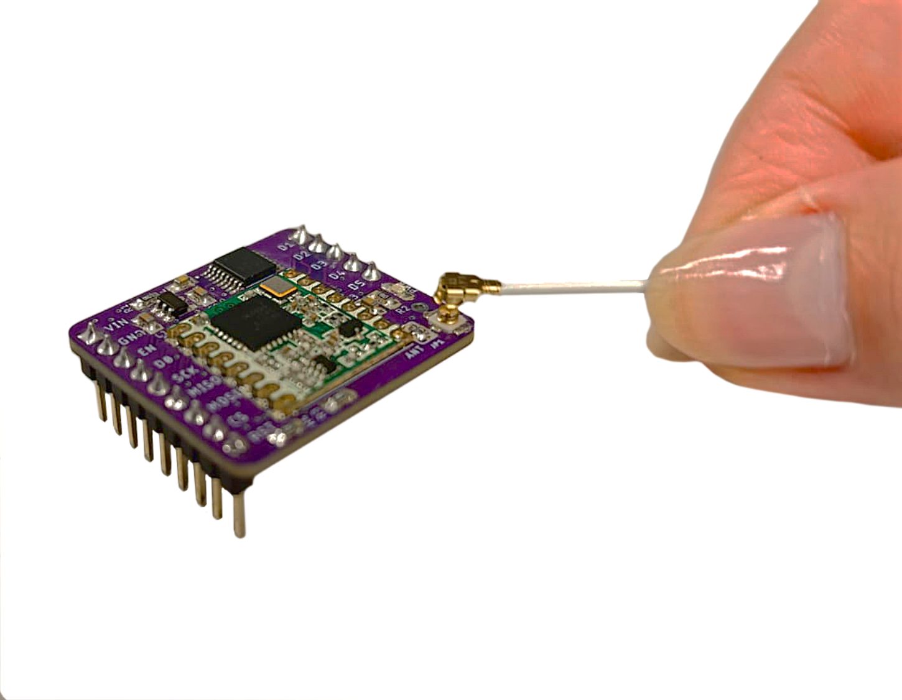

# LoRa Breakout



**LoRa-Breakout** es una tarjeta diseñada por **[MCI Electronics](https://mcielectronics.cl/)** que facilita y flexibiliza el uso del módulo LoRa SX1276, permitiendo la transmisión de información de forma segura con controladores de 3,3 o 5V, como [Arduino Uno](https://mcielectronics.cl/shop/product/arduino-uno-r3-arduino-10230/) o [Raspberry Pi PICO](https://mcielectronics.cl/shop/product/kit-de-inicio-raspberry-pi-pico-30215/). Gracias a esta tarjeta es más sencillo conseguir todos los beneficios de LoRa, como su largo alcance y alta seguridad ante intercepción, siendo ideal para ser aplicada en IoT.

## Características principales
- Módulo LoRa: SX1276 (915 MHz)
- Antena: Integrada tipo Coil / Externa u.FL
- Conexiones: VIN, GND, EN, SCK, MISO, MOSI, CS, RST, DIO0 – DIO5
- Voltaje soportado: 3.3V – 5V
- Medidas: 32 x 48mm

## Conexiones



## Empezando a usar LoRa Breakout

### Requerimientos de hardware
- Computador.
- Arduino Nano, Raspberry Pi Pico u otro microcontrolador compatible.
- Cable USB compatible con nuestro microcontrolador.
- Cables Hembra Hembra
- Antena con conector Ipex

### Conexión de la antena

Para que el módulo pueda mandar mensajes estables a larga distancia es necesario conectarle una antena con conector Ipex. De lo contrario, la distancia de transmisión será demasiado corta e inestable.



## Conexión usando Arduino

### Requerimientos de software con Arduino
- [Arduino IDE](https://support.arduino.cc/hc/en-us/articles/360019833020-Download-and-install-Arduino-IDE)
- Librería de la tarjeta (En caso de no usar una de las predeterminadas en Arduino IDE.)
- Librería [LoRa de Sandeepmistry](https://github.com/sandeepmistry/arduino-LoRa)

### Conexiones

Las conexiones cambian según qué microcontrolador se utilice. Lo importante es que:
- VIN se conecte 3.3V o 5V
- GND se conecte a GND
- SCK, MISO y MOSI se conecten a pins del mismo tipo
- CS, RST y D0 son programables con  LoRa.setPins(CS, RST, D0);, pero de forma predeterminada vienen los pins 10, 9 y 2 respectivamente.
- El pin EN sirve para apagar el módulo. No es necesario conectarlo
- El pin D0 solo es necesario conectar si se quiere utilizar el modo de recibir llamada.
- El resto de pins digitales sirven para controlar funciones internas del módulo y no son necesarias de conectar.

### Código transmisor

```cpp
#include <SPI.h>
#include <LoRa.h>

int counter = 0;

void setup() {
  //LoRa.setPins(2, 3, 4); // define pines CS, reset, DIO0. Pins actuales vienen por predeterminado en la librería.
  Serial.begin(9600);
  while (!Serial);

  Serial.println(" ");
  Serial.println("Diagnosis LoRa");

  if (!LoRa.begin(915E6)) {
    Serial.println("Fallo de inicialización, revisa las conexiones");
    while (!LoRa.begin(915E6));
  }
  Serial.println("LoRa conectado correctamente");
}

void loop() {
  Serial.print("Enviando paquete: ");
  Serial.println(counter);
  LoRa.beginPacket();
  LoRa.print(counter);
  LoRa.endPacket();
  counter++;
  delay(1000);
}
```

### Código receptor

```cpp
#include <SPI.h>
#include <LoRa.h>

void setup() {
  LoRa.setPins(2, 3, 4);
  Serial.begin(9600);
  while (!Serial);
  Serial.println(" ");
  Serial.println("Diagnostico LoRa");
  if (!LoRa.begin(915E6)) {
    Serial.println("Fallo de inicialización, revisa las conexiones");
    while (!LoRa.begin(915E6));
  }
  Serial.println("LoRa conectado correctamente");
}

void loop() {
  int packetSize = LoRa.parsePacket();
  if (packetSize) {
    Serial.print("Paquete recibido '");
    while (LoRa.available()) {
      Serial.print((char)LoRa.read());
    }
    Serial.print("' con RSSI ");
    Serial.println(LoRa.packetRssi());
  }
}
```

## Conexión usando Raspberry Pi Pico

### Requerimientos de software con Raspberry Pi Pico
- [Thonny](https://thonny.org/)

### Conexiones

Las conexiones cambian según qué microcontrolador se utilice. Lo importante es que:
- VIN se conecte 3.3V o 5V
- GND se conecte a GND
- Todo el resto de pins se define en el código. En este caso usaremos:
     - SCK al pin 2
     - MOSI al pin 3
     - MISO al pin 4
     - CS al pin 5
     - RST al pin 6
     - DIO0 al pin 7

### Código diagnóstico

```python
from machine import Pin, SPI
import time

# Pines SPI
spi = SPI(0, baudrate=5000000, polarity=0, phase=0,
          sck=Pin(2), mosi=Pin(3), miso=Pin(4))
cs = Pin(5, Pin.OUT)
reset = Pin(6, Pin.OUT)

cs.value(1)
reset.value(1)

REG_VERSION = 0x42
REG_OPMODE = 0x01
REG_IRQ_FLAGS = 0x12

def write_register(address, value):
    cs.value(0)
    spi.write(bytearray([address | 0x80, value]))
    cs.value(1)

def read_register(address):
    cs.value(0)
    spi.write(bytearray([address & 0x7F]))
    result = spi.read(1)
    cs.value(1)
    return result[0]

def reset_module():
    print("Reiniciando SX1276...")
    reset.value(0)
    time.sleep(0.01)
    reset.value(1)
    time.sleep(0.01)

def diagnostico_sx1276():
    print("Iniciando diagnóstico SX1276...\n")
    reset_module()
    version = read_register(REG_VERSION)
    print(f"RegVersion (0x42): {hex(version)}")
    if version == 0x12:
        print("SX1276 detectado correctamente.\n")
    else:
        print("RegVersion inesperado. Verifica conexiones SPI y alimentación.\n")
        return
    print("Probando escritura/lectura del registro RegOpMode (0x01)...")
    test_values = [0x80, 0x81, 0x82]
    success = False
    for val in test_values:
        write_register(REG_OPMODE, val)
        time.sleep(0.1)
        res = read_register(REG_OPMODE)
        print(f"   Escribí {hex(val)} → Leí {hex(res)}")
        if res == val:
            success = True
    if success:
        print("Escritura y lectura de RegOpMode funcionan correctamente.\n")
    else:
        print("Falló la escritura/lectura de RegOpMode. Revisa MOSI, CS y lógica SPI.\n")
    irq_flags = read_register(REG_IRQ_FLAGS)
    print(f"RegIrqFlags (0x12): {bin(irq_flags)}")
    print("\nDiagnóstico completo.")

diagnostico_sx1276()
```


###Código trasmisor:

Este código enviará un mensaje que diga “12345678” junto a un contador cada 5 segundos.

```python
from machine import Pin, SPI
import time

# Pines SPI y control
spi = SPI(0, baudrate=5000000, polarity=0, phase=0,
          sck=Pin(2), mosi=Pin(3), miso=Pin(4))
cs = Pin(5, Pin.OUT)
reset = Pin(6, Pin.OUT)

# Registros SX1276
REG_FIFO = 0x00
REG_OP_MODE = 0x01
REG_FIFO_ADDR_PTR = 0x0D
REG_FIFO_TX_BASE_ADDR = 0x0E
REG_IRQ_FLAGS = 0x12
REG_PAYLOAD_LENGTH = 0x22
REG_SYNC_WORD = 0x39
REG_FRF_MSB = 0x06
REG_FRF_MID = 0x07
REG_FRF_LSB = 0x08
REG_MODEM_CONFIG_1 = 0x1D
REG_MODEM_CONFIG_2 = 0x1E
REG_PA_CONFIG = 0x09

MODE_SLEEP = 0x80
MODE_STDBY = 0x81
MODE_TX = 0x83

# ------------------------------
# Funciones SPI (lectura/escritura)
# ------------------------------

def write_reg(addr, val):
    cs.value(0)
    spi.write(bytearray([addr | 0x80, val]))
    cs.value(1)

def read_reg(addr):
    cs.value(0)
    spi.write(bytearray([addr & 0x7F]))
    result = spi.read(1)
    cs.value(1)
    return result[0]

# ------------------------------
# Reseteo del módulo
# ------------------------------

def reset_lora():
    reset.value(0)
    time.sleep(0.01)
    reset.value(1)
    time.sleep(0.01)

# ------------------------------
# Inicialización del módulo
# ------------------------------

def init_lora():
    print("Inicializando transmisor SX1276...")
    reset_lora()
    write_reg(REG_OP_MODE, MODE_SLEEP)
    time.sleep(0.05)

    # Frecuencia: 915 MHz
    write_reg(REG_FRF_MSB, 0xE4)
    write_reg(REG_FRF_MID, 0xC0)
    write_reg(REG_FRF_LSB, 0x00)

    # Configuración LoRa
    write_reg(REG_SYNC_WORD, 0x12)        # Sync word común
    write_reg(REG_MODEM_CONFIG_1, 0x72)   # BW=125kHz, CR=4/5
    write_reg(REG_MODEM_CONFIG_2, 0x74)   # SF=7, CRC ON
    write_reg(REG_PA_CONFIG, 0x8F)        # Potencia alta segura

    # FIFO TX
    write_reg(REG_FIFO_TX_BASE_ADDR, 0x80)
    write_reg(REG_FIFO_ADDR_PTR, 0x80)

    write_reg(REG_OP_MODE, MODE_STDBY)
    print("Transmisor listo en modo standby.\n")

# ------------------------------
# Transmisión de un mensaje
# ------------------------------

def transmit(msg):
    print(f"Enviando: '{msg}'")
    write_reg(REG_IRQ_FLAGS, 0xFF)  # Limpia todas las flags

    # Cargar al FIFO
    payload = bytes(msg, 'utf-8')
    write_reg(REG_FIFO_ADDR_PTR, 0x80)
    for b in payload:
        write_reg(REG_FIFO, b)
    write_reg(REG_PAYLOAD_LENGTH, len(payload))

    print("Bytes cargados:", list(payload))

    # Confirmar modo standby antes de enviar
    mode_before = read_reg(REG_OP_MODE)
    print(f"Modo antes de enviar: {bin(mode_before)}")

    # Iniciar transmisión
    t0 = time.ticks_ms()
    write_reg(REG_OP_MODE, MODE_TX)

    # Confirmar que entró en modo TX
    time.sleep(0.01)
    mode_tx = read_reg(REG_OP_MODE)
    print(f"Modo después de MODE_TX: {bin(mode_tx)}")

    # Esperar TxDone
    timeout_ms = 1000
    while time.ticks_diff(time.ticks_ms(), t0) < timeout_ms:
        if read_reg(REG_IRQ_FLAGS) & 0x08:
            break
        time.sleep(0.01)

    t1 = time.ticks_diff(time.ticks_ms(), t0)
    flags = read_reg(REG_IRQ_FLAGS)

    if flags & 0x08:
        print(f"TxDone recibido en {t1} ms")
    else:
        print(f"TxDone NO recibido en {t1} ms")
    
    print(f"RegIrqFlags final: {bin(flags)}")
    write_reg(REG_IRQ_FLAGS, 0xFF)
    write_reg(REG_OP_MODE, MODE_STDBY)
    print("Transmisión finalizada.\n")

# ------------------------------
# Bucle principal
# ------------------------------
init_lora()
contador = 0

while True:
    mensaje = f"12345678 #{contador}"
    transmit(mensaje)
    contador += 1
    time.sleep(5)
```

###Código receptor:

Este código recibe la información enviada-

```python
from machine import Pin, SPI
import time

# Pines SPI y control
spi = SPI(0, baudrate=5000000, polarity=0, phase=0,
          sck=Pin(2), mosi=Pin(3), miso=Pin(4))
cs = Pin(5, Pin.OUT)
reset = Pin(6, Pin.OUT)
dio0 = Pin(7, Pin.IN)

# Registros
REG_FIFO = 0x00
REG_OP_MODE = 0x01
REG_FIFO_ADDR_PTR = 0x0D
REG_FIFO_RX_BASE_ADDR = 0x0F
REG_FIFO_RX_CURRENT_ADDR = 0x10
REG_IRQ_FLAGS = 0x12
REG_RX_NB_BYTES = 0x13
REG_PKT_RSSI_VALUE = 0x1A
REG_PKT_SNR_VALUE = 0x1B
REG_SYNC_WORD = 0x39
REG_FRF_MSB = 0x06
REG_FRF_MID = 0x07
REG_FRF_LSB = 0x08
REG_MODEM_CONFIG_1 = 0x1D
REG_MODEM_CONFIG_2 = 0x1E
REG_PA_CONFIG = 0x09

MODE_SLEEP = 0x80
MODE_STDBY = 0x81
MODE_RXCONTINUOUS = 0x85

# ------------------------------
# Funciones SPI (lectura/escritura)
# ------------------------------

def write_reg(addr, val):
    cs.value(0)
    spi.write(bytearray([addr | 0x80, val]))
    cs.value(1)

def read_reg(addr):
    cs.value(0)
    spi.write(bytearray([addr & 0x7F]))
    result = spi.read(1)
    cs.value(1)
    return result[0]

# ------------------------------
# Reseteo del módulo
# ------------------------------

def reset_lora():
    reset.value(0)
    time.sleep(0.01)
    reset.value(1)
    time.sleep(0.01)

# ------------------------------
# Inicialización del módulo
# ------------------------------

def init_lora():
    print("Inicializando receptor SX1276...")
    reset_lora()
    write_reg(REG_OP_MODE, MODE_SLEEP)
    time.sleep(0.05)

    # Frecuencia: 915 MHz
    write_reg(REG_FRF_MSB, 0xE4)
    write_reg(REG_FRF_MID, 0xC0)
    write_reg(REG_FRF_LSB, 0x00)

    # Configuración LoRa
    write_reg(REG_SYNC_WORD, 0x12)
    write_reg(REG_MODEM_CONFIG_1, 0x72)  # BW 125kHz, CR 4/5
    write_reg(REG_MODEM_CONFIG_2, 0x74)  # SF7, CRC ON

    # FIFO
    write_reg(REG_FIFO_RX_BASE_ADDR, 0x00)
    write_reg(REG_FIFO_ADDR_PTR, 0x00)

    # Activar modo recepción continua
    write_reg(REG_OP_MODE, MODE_RXCONTINUOUS)
    print("Receptor en modo RxContinuous.\n")

# ------------------------------
# Recepción de un paquete
# ------------------------------

def handle_packet():
    flags = read_reg(REG_IRQ_FLAGS)

    if flags & 0x40:  # RxDone
        print("\nPaquete recibido (RxDone)")
        crc_error = bool(flags & 0x20)

        if crc_error:
            print("Error de CRC. Paquete descartado.")
        else:
            current_addr = read_reg(REG_FIFO_RX_CURRENT_ADDR)
            write_reg(REG_FIFO_ADDR_PTR, current_addr)
            length = read_reg(REG_RX_NB_BYTES)
            print(f"Tamaño del paquete: {length} bytes")

            data = bytearray()
            for _ in range(length):
                data.append(read_reg(REG_FIFO))

            print("Bytes crudos:", list(data))
            try:
                decoded = data.decode('utf-8')
                print(f"Payload (texto): {decoded}")
            except:
                print("No se pudo decodificar como texto.")

            rssi = read_reg(REG_PKT_RSSI_VALUE)
            snr = read_reg(REG_PKT_SNR_VALUE)
            if snr > 127:
                snr = ((~snr + 1) & 0xFF) * -0.25
            else:
                snr = snr * 0.25
            rssi_dbm = -157 + rssi + 137
            print(f"RSSI: {rssi_dbm} dBm | SNR: {snr:.2f} dB")

    elif flags:
        print(f"IRQ Flags inesperadas: {bin(flags)}")

    # Limpiar todas las flags
    write_reg(REG_IRQ_FLAGS, 0xFF)

# ------------------------------
# Bucle principal
# ------------------------------

init_lora()
while True:
    if dio0.value():
        handle_packet()
    time.sleep(0.01)
```


